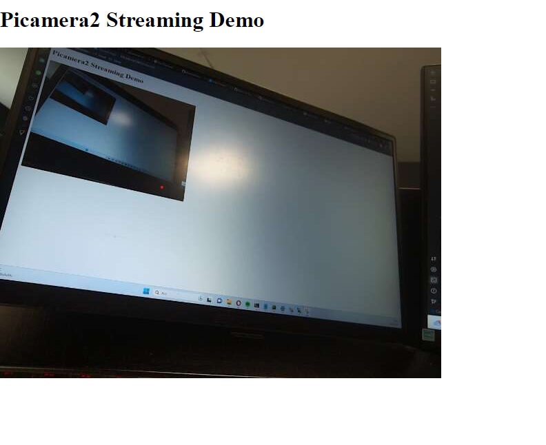

## Raspberry Pi Cam Module 3 (picamera2 library) video stream with Flask

* This application combination with https://github.com/raspberrypi/picamera2/blob/main/examples/mjpeg_server.py and https://www.hackster.io/ruchir1674/video-streaming-on-flask-server-using-rpi-ef3d75 

